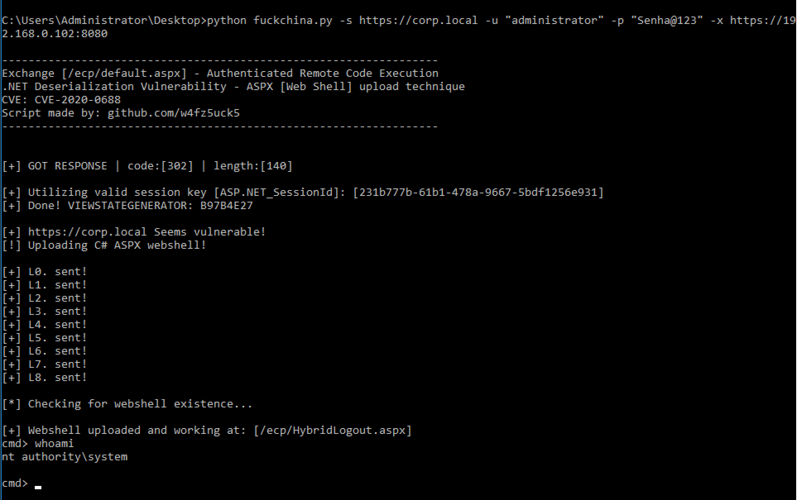

# ViperX Offensive Security

Requires: python3+

[UNIVERSAL] Python implementation for (cve-2020-0688), using ASPX webshell for custom command output

This document serves as a Proof of Concept (POC) intended solely to aid in demonstrating vulnerabilities for security enhancement purposes. I expressly disavow any illicit activities and hereby declare that I bear no responsibility for the actions executed by this script.

## Exchange Remote Code Execution (cve-2020-0688)
